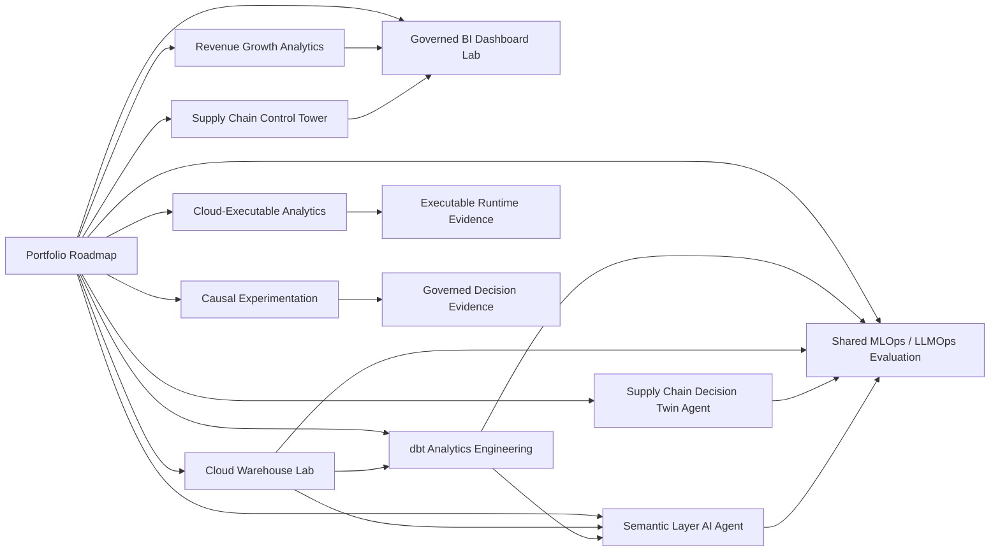

# Emmanuel Beristain Guzman

## AI-Native Data & Analytics Engineer

**Analytics Engineering • Business Intelligence • SQL • Python • dbt • Data Pipelines • Decision Intelligence • AI-Augmented Analytics**

I build reproducible analytics and decision-support systems that transform operational, commercial, marketplace, CRM, and supply-chain data into governed metrics, analytical models, dashboards, automated workflows, simulations, experiments, and evidence-backed recommendations.

My portfolio is organized as a connected evidence system rather than a collection of isolated repositories. The central entry point is the **[AI-Native Analytics Portfolio Roadmap](https://github.com/net421/AI-Native-Analytics-Portfolio-Roadmap)**, which maps capabilities to repositories, artifacts, validation, claim boundaries, and target roles.

**Portfolio structure:** 12 active repositories • 6 foundational analytics systems • 5 AI-native systems • 7 preserved historical/scientific evidence repositories

---

## Portfolio Architecture



The strict, commit-pinned integrations are the Semantic Agent with dbt and warehouse models, and the shared evaluation system with the Semantic Agent, Decision Twin, dbt, and warehouse repositories. Other arrows describe complementary portfolio relationships, not a claim that every project is deployed as one production platform.

---

## Active Portfolio System

### Control Plane

| Repository | Role in the system |
|---|---|
| **[AI-Native Analytics Portfolio Roadmap](https://github.com/net421/AI-Native-Analytics-Portfolio-Roadmap)** | Central architecture, release ledger, evidence graph, claim boundaries, frozen-history policy, review paths, and portfolio validation |

### Foundational Analytics Engineering

| Repository | Evidence | Relationship |
|---|---|---|
| [Supply Chain Operations Control Tower](https://github.com/net421/supply-chain-operations-control-tower) | ERP/WMS/TMS-style synthetic data, OTIF, fill rate, service, inventory, and logistics-cost KPIs | Operational source and KPI evidence for BI and decision-support use cases |
| [Cloud Warehouse Analytics Lab](https://github.com/net421/cloud-warehouse-analytics-lab) | Executable DuckDB warehouse, analytical marts, cross-platform SQL patterns, tests, and reproducible exports | Governed warehouse source for dbt and the Semantic Layer Agent |
| [dbt Analytics Engineering Lab](https://github.com/net421/dbt-analytics-engineering-lab) | Staging, intermediate, marts, snapshot, exposures, tests, lineage, and documentation | Semantic modeling layer consumed contractually by the Semantic Layer Agent and shared evaluator |
| [Orchestration Data Pipelines Lab](https://github.com/net421/orchestration-data-pipelines-lab) | Validation-first pipeline, deterministic generation, retry policy, idempotency, atomic publication, and failure recovery | Execution and reliability patterns for the analytics lifecycle |
| [Tableau BI Dashboard Lab](https://github.com/net421/tableau-bi-dashboard-lab) | Governed metric contracts, reconciled extracts, dashboard specifications, and Tableau/Looker/Sigma/Power BI patterns | Presentation and semantic-consumption layer for operations and growth analytics |
| [Revenue Growth Analytics Engineering](https://github.com/net421/revenue-growth-analytics-engineering) | Funnel, cohorts, MRR, GRR/NRR, CAC, ROAS, LTV, segmentation, and churn-risk evidence | Commercial analytics domain feeding governed BI and decision narratives |

### AI-Native Analytics and Decision Systems

| Repository | Evidence | Relationship |
|---|---|---|
| [Semantic Layer AI Agent Lab](https://github.com/net421/semantic-layer-ai-agent-lab) | Governed questions, semantic catalog, read-only SQL, lineage, refusals, independent reconciliation, and upstream drift detection | Contractually connected to dbt and cloud warehouse models |
| [MLOps / LLMOps Evaluation Lab](https://github.com/net421/mlops-llmops-evaluation-lab) | Shared release gate, normalized evidence, regression testing, model/agent evaluation, and fail-closed decisions | Evaluates the Semantic Agent and Decision Twin against pinned upstream releases |
| [Supply Chain Decision Twin Agent](https://github.com/net421/supply-chain-decision-twin-agent) | Preserved Dify/RAG/FastAPI demo plus deterministic forecasting, scenario simulation, action ranking, persistence, and human approval | Decision-support agent evaluated by the shared MLOps/LLMOps gate; never executes operational actions autonomously |
| [Causal Experimentation Lab](https://github.com/net421/causal-experimentation-lab) | Randomized experiment, ANCOVA, HC1 uncertainty, permutation inference, robustness checks, and causal release envelope | Adds governed intervention evidence to the decision-intelligence layer |
| [Cloud-Executable Analytics Lab](https://github.com/net421/cloud-executable-analytics-lab) | Deterministic pipeline, contracts, SQLite evidence, atomic publication, non-root Docker, read-only root filesystem, and CI | Demonstrates executable packaging and release evidence without claiming a real production cloud deployment |

---

## Connected Evidence Paths

### Analytics Engineering and AI-Native Path

```text
Operational / Commercial Questions
        ↓
Cloud Warehouse + Domain Analytics
        ↓
dbt Models and Governed Metrics
        ↓
Semantic Layer AI Agent
        ↓
Shared MLOps / LLMOps Evaluation
        ↓
Human-Reviewed Analytical Decision Support
```

The Control Tower and Revenue Growth repositories provide domain evidence. The BI repository demonstrates governed consumption. Orchestration and Cloud-Executable Analytics demonstrate reliable execution and packaging. Causal Experimentation and the Decision Twin add intervention and scenario-analysis evidence.

### Scientific and Historical Research Lineage

```text
Near-Critical Systems research
        ↓
Controlled Near-Critical benchmark
        ↓
Supply Chain Digital Twin application
        ↓
Industrial Risk Control / research automation
```

This research line connects stochastic theory, controlled benchmarking, digital-twin application, and reproducible research engineering. The marketplace, CRM/revenue, and operational-risk repositories add earlier domain evidence that informs the newer analytics-engineering portfolio.

---

## Preserved Historical and Scientific Evidence

These repositories remain linked because they provide scientific, historical, domain, and paper-related evidence. They are intentionally preserved and were not modified during the active portfolio modernization.

| Repository | Evidence relationship |
|---|---|
| [Near-Critical Systems](https://github.com/net421/near-critical-systems) | Foundational stochastic and first-passage reliability research |
| [Controlled Near-Critical](https://github.com/net421/controlled-near-critical) | Controlled benchmark connecting theory to threshold-policy experiments |
| [Industrial Risk Control](https://github.com/net421/industrial-risk-control) | Reproducible research automation, evidence provenance, testing, and bounded workflows |
| [Supply Chain Digital Twin](https://github.com/net421/Supply-Chain-Digital-Twin) | Historical application of simulation, optimization, network science, and resilience analysis |
| [Marketplace Intelligence Platform](https://github.com/net421/Marketplace-Intelligence-Platform) | Historical marketplace, customer, seller, delivery, revenue, and network-risk evidence |
| [CRM Revenue Intelligence Dashboard](https://github.com/net421/CRM-Revenue-Intelligence-Dashboard) | Historical CRM, sales-performance, conversion, and executive-reporting evidence |
| [Operational Risk & Reliability Analytics](https://github.com/net421/operational-risk-reliability-analytics) | Historical failure-probability, severity, utilization, cost-exposure, SQL, Python, and BI evidence |

> Los siete repositorios históricos aportan evidencia al portafolio, pero permanecen fuera del backlog de implementación, corrección, estandarización y publicación.

They are connected through references and evidence lineage only. Their code, documentation, structure, dependencies, workflows, releases, branches, commits, and publication state remain unchanged.

---

## How I Work

I use AI as an execution and review layer, not as a substitute for analytical judgment. My workflow is:

1. Define the business question, users, metrics, constraints, and claim boundary.
2. Build SQL, Python, dbt, BI, orchestration, agent, or experimental artifacts.
3. Validate outputs with contracts, reconciliations, tests, CI, and reproducibility checks.
4. Preserve human approval for consequential decisions.
5. Publish only claims supported by inspectable evidence.

The default scope of the portfolio is synthetic, local, or laboratory evidence unless a repository explicitly provides external deployment evidence. No repository claims autonomous operational execution.

---

## Core Capabilities

| Area | Capabilities |
|---|---|
| Analytics Engineering | Advanced SQL • dbt • Dimensional Modeling • Marts • Tests • Lineage • Semantic Contracts |
| Data Engineering | Python Pipelines • ELT/ETL • Orchestration • Idempotency • Atomic Publication • Data Quality |
| Business Intelligence | KPI Governance • Tableau • Power BI • DAX • Looker/Sigma Patterns • Executive Reporting |
| AI-Native Analytics | Governed Agents • Semantic Layers • RAG/API Orchestration • LLM Evaluation • Refusals • Evidence Traces |
| Decision Intelligence | Scenario Simulation • Digital Twins • Causal Experiments • Human Approval • Policy Evaluation |
| Domain Analytics | Supply Chain • Logistics • Revenue/Growth • Marketplace • CRM • Operational Risk |
| Research Engineering | Monte Carlo • Statistical Inference • Reproducibility • Evidence Provenance • CI/CD |

---

## Technology Stack

**Python** • **SQL** • **dbt** • **DuckDB** • **SQLite** • **Pandas** • **NumPy** • **FastAPI** • **Docker** • **GitHub Actions** • **Tableau** • **Power BI** • **DAX** • **Power Query** • **Looker / LookML Patterns** • **Sigma Patterns** • **Airflow** • **Prefect** • **Snowflake / BigQuery / Databricks Patterns** • **pytest** • **AI-Assisted Development**

---

## Professional Direction

Focused on opportunities in **Analytics Engineering, Data & Analytics Engineering, Business Intelligence, Senior Data Analysis, Operations Analytics, Supply Chain Analytics, Revenue/Growth Analytics, Analytics Consulting, Decision Intelligence, and AI-Augmented Data Workflows**.

Start with the **[Portfolio Roadmap](https://github.com/net421/AI-Native-Analytics-Portfolio-Roadmap)** for the complete architecture, evidence ledger, integration boundaries, and role-based review paths.
